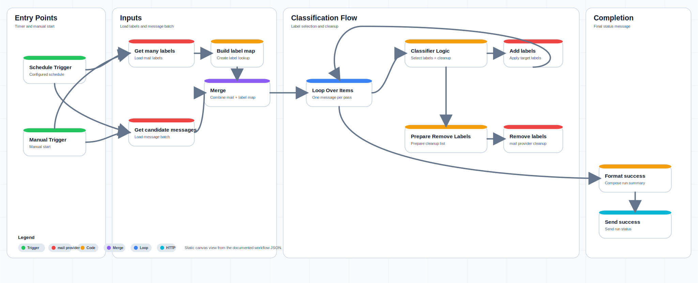
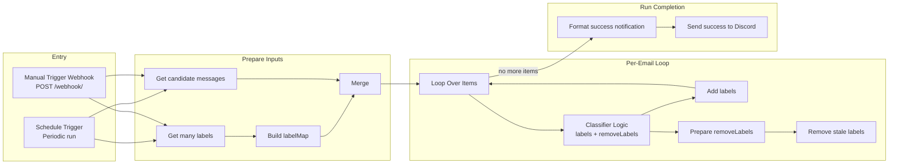
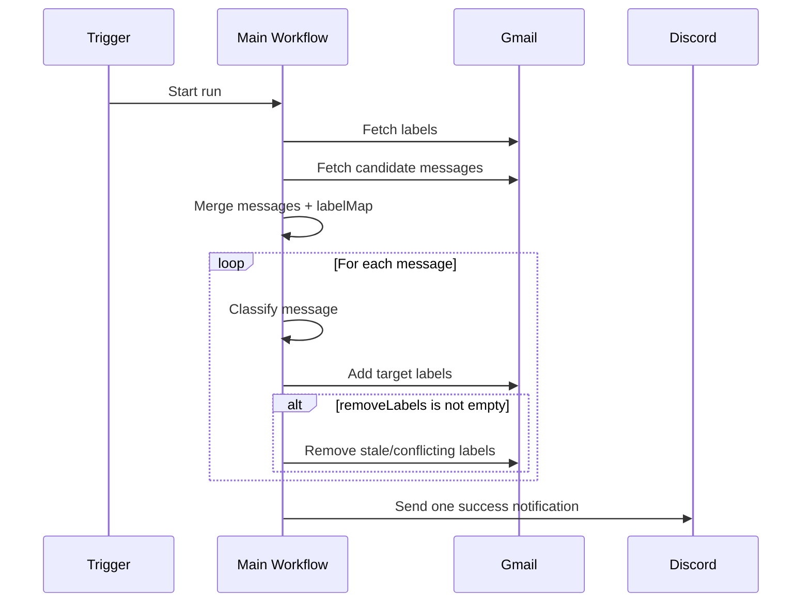
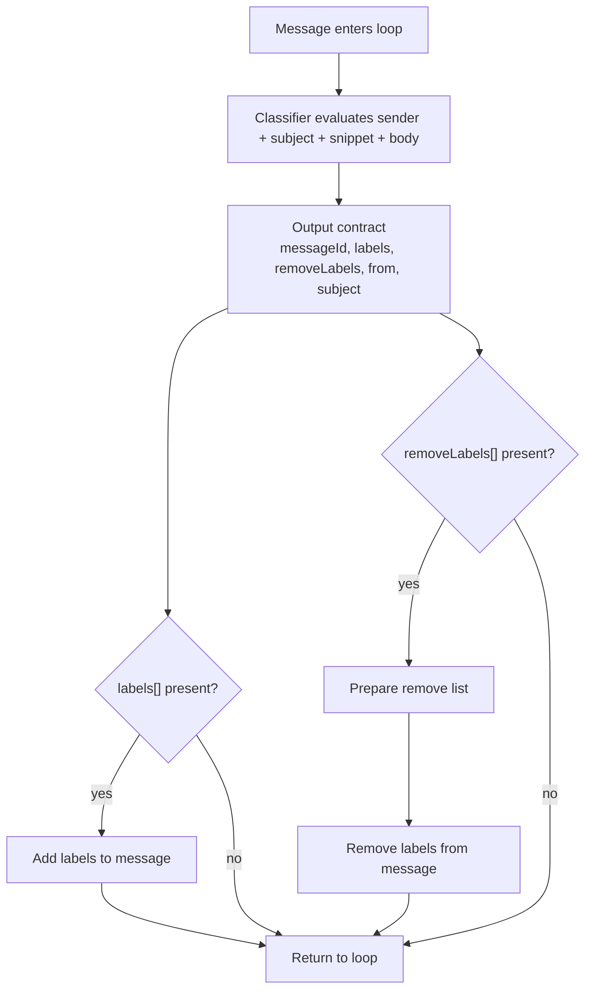
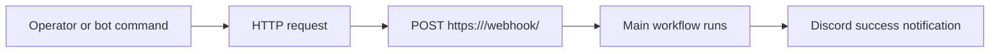
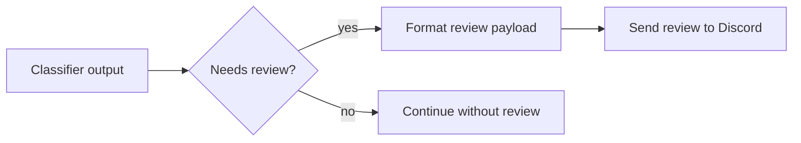

# n8n Mail Classifier Workflow

It answers one practical question:

`How does a run move from trigger -> Gmail fetch -> classify -> label cleanup -> notification?`

## Workflow Shape

- scheduled trigger
- manual webhook trigger
- label-map preparation
- per-message loop
- classifier output with `labels` and `removeLabels`
- Gmail add/remove operations
- one end-of-run success notification

## Canvas View

For the closest editor-style visualization, open [workflow-canvas.svg](./workflow-canvas.svg).



## Operator Map



## Story Of One Run



## Story Of One Email



## Why `removeLabels` Exists

The workflow removes labels to keep the final Gmail state clean.

Example:

```text
Classifier chooses:
- Category/Finance

Add:
- Category/Finance

Remove if present:
- Category/Marketing
- [review-needed]
- other mutually exclusive primary labels
```

This prevents old and new classifications from living on the same message.

## Manual Trigger View



## Review Branch Concept

The optional review workflow should branch from the classifier output, not from Gmail result nodes.



Typical review signals:

- `[review-needed]`
- `removeLabels.length > 0`
- two competing primary categories
- explicit debug override

## Output Contract

```json
{
  "messageId": "gmail-message-id",
  "labels": ["Category/Finance"],
  "removeLabels": ["Category/Marketing", "[review-needed]"],
  "from": "Sender <sender@example.com>",
  "subject": "Message subject"
}
```
